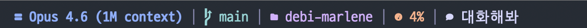
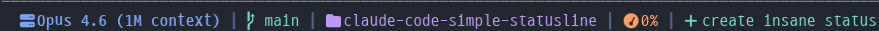

<div align="center">

**English** | **[한국어](README.ko.md)**

# Claude Code Statusline

A simple, minimal statusline for [Claude Code](https://docs.anthropic.com/en/docs/claude-code).

[](LICENSE)
[](https://python.org)
[](https://docs.anthropic.com/en/docs/claude-code)




**One-line install (macOS/Linux):**
```bash
curl -fsSL https://raw.githubusercontent.com/2rami/claude-code-simple-statusline/main/install.sh | bash
```

**One-line install (Windows PowerShell):**
```powershell
irm https://raw.githubusercontent.com/2rami/claude-code-simple-statusline/main/install.ps1 | iex
```

</div>

---

## Full Setup (Harness Engineering Edition)

Install everything at once, or pick what you need:

**All at once:**
```bash
curl -fsSL https://raw.githubusercontent.com/2rami/claude-code-simple-statusline/main/setup.sh | bash -s -- all
```

**Individual components:**

> Tip: save the URL first — `S="https://raw.githubusercontent.com/2rami/claude-code-simple-statusline/main/setup.sh"`

**1. Node.js** — Auto-installs via brew (macOS) or fnm (Linux) if missing
```bash
curl -fsSL $S | bash -s -- node
```

**2. Claude Code** — Installs the CLI globally via `npm i -g @anthropic-ai/claude-code`
```bash
curl -fsSL $S | bash -s -- claude
```

**3. Status Line** — D2Coding Nerd Font + statusline with prompt classification + hook
```bash
curl -fsSL $S | bash -s -- statusline
```

**4. MCP Servers** — context7 (auto-fetch library docs) + exa (web search, API key optional)
```bash
curl -fsSL $S | bash -s -- mcp
```

**5. Skills** — Enables plugins in settings.json: context7, frontend-design, chrome-devtools, claude-md-management
```bash
curl -fsSL $S | bash -s -- skills
```

**6. Settings** — Configures settings.json: permission bypass (`skipDangerousModePermissionPrompt`), team mode (`CLAUDE_CODE_EXPERIMENTAL_AGENT_TEAMS`), no-flicker rendering (`CLAUDE_CODE_NO_FLICKER`)
```bash
curl -fsSL $S | bash -s -- settings
```

**7. CLAUDE.md** — Overwrites `~/.claude/CLAUDE.md` with opinionated coding rules (backs up existing to `.bak`)
```bash
curl -fsSL $S | bash -s -- claudemd
```

---

## Features

| Segment | Info | Color |
|---------|------|-------|
| Model | Current Claude model name | `#7aa2f7` Blue |
| Git Branch | Active branch from `git` | `#73daca` Green |
| Project | Working directory name | `#bb9af7` Purple |
| Context | Context window usage % | `#ff9e64` Orange |
| Prompt | Last prompt with intent icon | Varies |

### Prompt Classification

The statusline automatically classifies your last prompt and shows a matching icon:

| Intent | Icon | Color | Keywords |
|--------|------|-------|----------|
| Command | `` | Yellow | `/slash` commands |
| Question | `` | Blue | Contains `?` |
| Delete | `` | Red | delete, remove, drop |
| Edit | `` | Yellow | fix, edit, update, refactor |
| Create | `` | Green | create, add, build, implement |
| Search | `` | Purple | analyze, review, search, explain |
| Chat | `` | White | General conversation |
| Idle | `` | Dim | No prompt yet |

## Requirements

- [Claude Code](https://docs.anthropic.com/en/docs/claude-code) CLI
- Python 3.11+
- A terminal font that supports the icon set you choose (see [Font Setup](#font-setup))

## Font Setup

The default icon set uses **Nerd Font** glyphs. This project uses **D2Coding Nerd Font** — a monospace font with Korean support, ligatures, and Nerd Font icons built in.

The installer automatically downloads and installs the font. To install manually:

<details>
<summary><b>macOS (Homebrew)</b></summary>

```bash
brew install --cask font-d2coding-nerd-font
```
</details>

<details>
<summary><b>Windows</b></summary>

Download from [Nerd Fonts GitHub](https://github.com/ryanoasis/nerd-fonts/releases/latest/download/D2Coding.zip), extract, and install the `.ttf` files.
</details>

<details>
<summary><b>Linux</b></summary>

```bash
curl -fsSL https://github.com/ryanoasis/nerd-fonts/releases/latest/download/D2Coding.tar.xz -o /tmp/D2Coding.tar.xz
mkdir -p ~/.local/share/fonts
tar -xf /tmp/D2Coding.tar.xz -C ~/.local/share/fonts
fc-cache -fv
```
</details>

### Set Terminal Font

After installing, set **D2Coding Nerd Font** as your terminal font:

| Terminal | Setting |
|----------|---------|
| **iTerm2** | Preferences > Profiles > Text > Font |
| **Terminal.app** | Preferences > Profiles > Font |
| **Windows Terminal** | Settings > Profiles > Appearance > Font face |
| **VS Code** | `terminal.integrated.fontFamily` in settings |
| **Alacritty** | `font.normal.family` in `alacritty.toml` |
| **Warp** | Settings > Appearance > Font |

> Don't want to install a Nerd Font? Switch to `"icon_set": "unicode"` or `"plain"` in the config. See [Icon Sets](#icon-sets).

## Install

### macOS / Linux

**One-line install:**

```bash
curl -fsSL https://raw.githubusercontent.com/2rami/claude-code-simple-statusline/main/install.sh | bash
```

**Manual install:**

1. Copy files to `~/.claude/`:

```bash
cp statusline.py ~/.claude/statusline.py
cp configure.py ~/.claude/configure-statusline.py
cp user_prompt_submit.py ~/.claude/user_prompt_submit.py
cp config.json ~/.claude/statusline-config.json
chmod +x ~/.claude/statusline.py ~/.claude/configure-statusline.py ~/.claude/user_prompt_submit.py
```

2. Add to your `~/.claude/settings.json`:

```json
{
  "statusLine": {
    "type": "command",
    "command": "~/.claude/statusline.py",
    "padding": 0
  },
  "hooks": {
    "UserPromptSubmit": [{
      "matcher": "*",
      "hooks": [{
        "type": "command",
        "command": "python3 ~/.claude/user_prompt_submit.py"
      }]
    }]
  }
}
```

3. Restart Claude Code.

### Windows

**One-line install (PowerShell):**

```powershell
irm https://raw.githubusercontent.com/2rami/claude-code-simple-statusline/main/install.ps1 | iex
```

**Manual install:**

1. Copy files to `%USERPROFILE%\.claude\`:

```powershell
Copy-Item statusline.py $env:USERPROFILE\.claude\statusline.py
Copy-Item configure.py $env:USERPROFILE\.claude\configure-statusline.py
Copy-Item user_prompt_submit.py $env:USERPROFILE\.claude\user_prompt_submit.py
Copy-Item config.json $env:USERPROFILE\.claude\statusline-config.json
```

2. Add to your `%USERPROFILE%\.claude\settings.json`:

```json
{
  "statusLine": {
    "type": "command",
    "command": "python C:/Users/YOU/.claude/statusline.py",
    "padding": 0
  },
  "hooks": {
    "UserPromptSubmit": [{
      "matcher": "*",
      "hooks": [{
        "type": "command",
        "command": "python C:/Users/YOU/.claude/user_prompt_submit.py"
      }]
    }]
  }
}
```

> Replace `C:/Users/YOU` with your actual user path.

3. Restart Claude Code.

## Configuration

### Interactive CLI (Recommended)

Run the interactive configurator with arrow-key navigation:

```bash
uv run ~/.claude/configure-statusline.py
```

You can change icon sets, colors, separator, prompt length, and individual icons — all from the terminal without editing files manually.

### Manual Configuration

All customization is done through `config.json`. The script looks for config in this order:

1. `~/.claude/statusline-config.json`
2. `config.json` next to the script

### Icon Sets

Switch between icon sets with `icon_set`:

```json
{
  "icon_set": "nerd-font"
}
```

| Set | Requirement | Example |
|-----|-------------|---------|
| `nerd-font` | Nerd Font installed | ` Opus 4.5 \|  main \|  my-project` |
| `unicode` | Any modern font | `> Opus 4.5 \| * main \| ~ my-project` |
| `plain` | Any font | `[M] Opus 4.5 \| [G] main \| [D] my-project` |

### Custom Icons Per Segment

Override individual icons regardless of the preset:

```json
{
  "icon_set": "nerd-font",
  "icons": {
    "model": "\uf233",
    "git": "\ue0a0",
    "folder": "\uf07b",
    "context": "\uf0e4",
    "prompt": {
      "command": "\uf120",
      "question": "\uf128",
      "delete": "\uf1f8",
      "edit": "\uf040",
      "create": "\uf067",
      "search": "\uf002",
      "chat": "\uf075",
      "idle": "\uf10c"
    }
  }
}
```

### Custom Colors

Override any color with hex values:

```json
{
  "colors": {
    "model": "#7aa2f7",
    "git": "#73daca",
    "folder": "#bb9af7",
    "context": "#ff9e64",
    "separator": "#565f89",
    "prompt": {
      "command": "#e0af68",
      "question": "#7aa2f7",
      "delete": "#f7768e",
      "edit": "#e0af68",
      "create": "#73daca",
      "search": "#bb9af7",
      "chat": "#c0caf5",
      "idle": "#565f89"
    }
  }
}
```

### Other Options

| Key | Default | Description |
|-----|---------|-------------|
| `separator` | `\|` | Character between segments |
| `prompt_max_length` | `5` | Max characters shown from prompt text |

## How It Works

Claude Code's `statusLine` setting supports `"type": "command"`, which pipes a JSON object to stdin containing:

```json
{
  "model": { "display_name": "Opus 4.5" },
  "cwd": "/path/to/project",
  "session_id": "abc123",
  "context_window": { "used_percentage": 42 }
}
```

The script parses this, fetches git info and the last prompt (saved by the `UserPromptSubmit` hook), then outputs a styled string with ANSI escape codes.

## License

[MIT](LICENSE)
